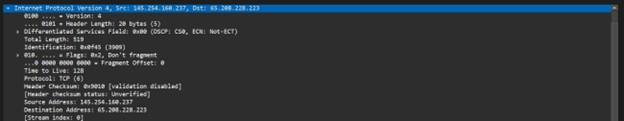
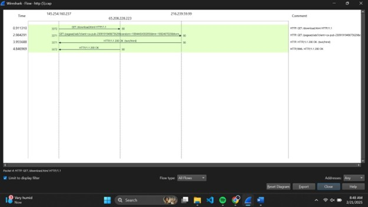
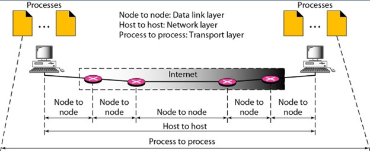

# Tugas-Analisa-HTTP
# Analisa HTTP

## Administrasi Jaringan

**Tugas Menganalisa File HTTP.CAP**

**Nama:** Raihan Malano A.  
**NRP:** 3123600019  
**Kelas:** D4 IT A

---

### 1. Versi HTTP yang digunakan, IP address dari client maupun server, waktu dari client mengirimkan HTTP request, waktu dari server mengirimkan server, dan berapa durasinya

- **Versi HTTP yang digunakan:**
    
    
    - Di Packet HTTP request dijelaskan bahwa versi HTTP yang digunakan adalah versi 1.1.

- **IP client dan server:**

  {width=600}
    - Di halaman IPv4 protocol dicantumkan bahwa IP Source adalah:  
      - Source (client): 145.254.160.237  
      - Destination (server): 65.208.228.223

- **Waktu mengirimkan HTTP request:**
  
    - Waktu dari client mengirimkan HTTP request adalah 0.91 dan untuk durasinya adalah:  
      - 3.95 - 0.91 = 3.04 detik.

---

### 2. Analisa gambar berikut

Pada gambar tersebut dijelaskan proses komunikasi dengan membagi perjalanan data menjadi tiga tahap utama:

- **Node to Node:**
    - Data berpindah antar perangkat fisik seperti dari PC ke router. Untuk protokol yang bekerja pada lapisan ini termasuk Ethernet dan Wi-Fi. Setiap hop antar dua node diatur oleh data link layer.

- **Host to Host:**
    - Mengatur paket data dari client ke server dengan jaringan yang lebih luas. Protokol yang bekerja pada lapisan ini adalah IP. Routing terjadi di sini, di mana paket berpindah dari satu router ke router lainnya.

- **Process to Process:**
    - Mengelola komunikasi langsung antara proses di kedua ujung komunikasi. Protokol pada layer ini adalah TCP dan UDP. Menangani segmentasi, pengendalian aliran, dan error.

---

### 3. Rangkuman tahapan TCP

- **3-Way Handshake:**
    1. Client mengirimkan paket SYN ke server.
)
    2. Server merespon dengan SYN-ACK.
    3. Client membalas dengan ACK.

- Setelah koneksi terbentuk, HTTP request dikirim.
- Server merespon dengan HTTP response.
- Jika komunikasi selesai, koneksi ditutup dengan **4-Way Handshake** (FIN, ACK, FIN, ACK).

---
