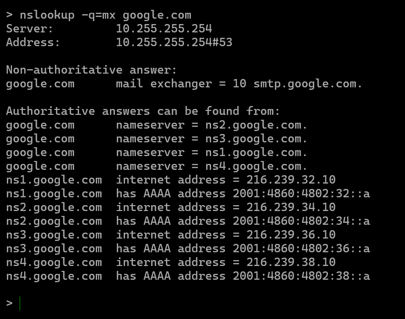
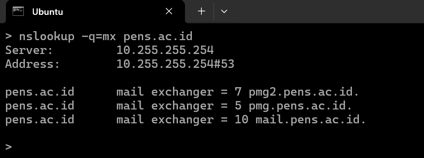
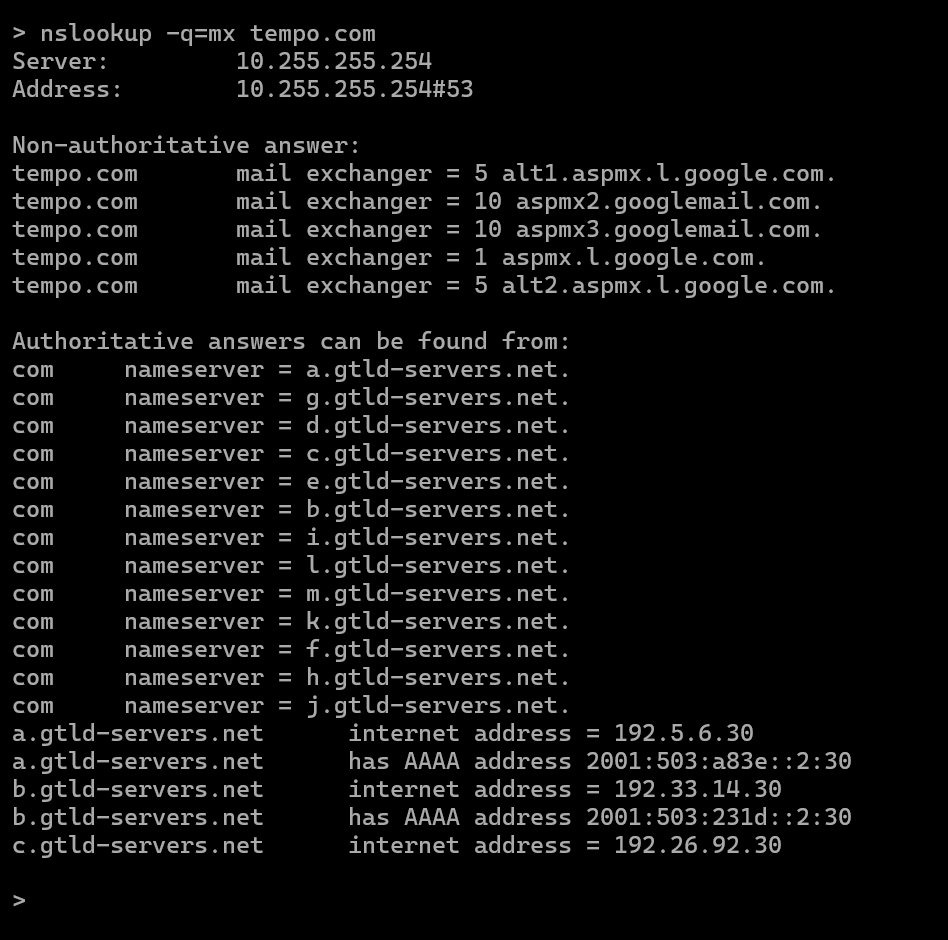
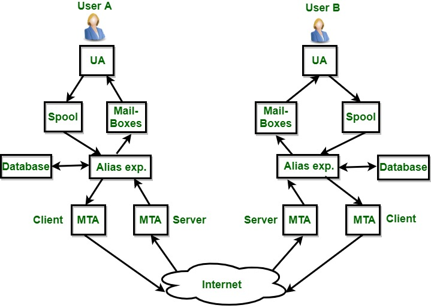

# LAPORAN PRAKTIKUM ADMINISTRASI JARINGAN

**Mata Kuliah:**  
Praktikum Administrasi Jaringan

**Dosen Pengampu:**  
Dr. Ferry Astika Saputra, ST, M.Sc

**Disusun oleh:**  
Raihan Malano Arrasyid  
NIM: 3123600019  
Kelas: 2 D4 Teknik Informatika A

---

## PROTOKOL MAIL

### 1. SMTP
Simple Mail Transfer Protocol (SMTP) merupakan protokol standar yang digunakan untuk mengirim email, baik dari email client (seperti Gmail atau Outlook) ke server maupun antar server. SMTP hanya menangani pengiriman, bukan penerimaan email. Saat pengguna menekan tombol “Send”, SMTP bertugas mengirimkan pesan hingga mencapai server tujuan.

Protokol ini tidak menyimpan pesan, melainkan hanya bertindak sebagai kurir. Oleh sebab itu, SMTP biasanya dikombinasikan dengan POP3 atau IMAP untuk pengambilan email.

Port yang umum digunakan SMTP:
- **Port 25** – Default port tanpa enkripsi (saat ini sering diblokir oleh ISP).
- **Port 587** – Digunakan untuk koneksi SMTP aman menggunakan STARTTLS.
- **Port 465** – Untuk koneksi SMTP dengan SSL/TLS (deprecated, namun masih digunakan).

### 2. POP3
Post Office Protocol versi 3 (POP3) adalah protokol standar untuk mengambil email dari server ke perangkat pengguna. POP3 memungkinkan pesan-pesan diunduh dan dibaca secara offline. Namun, umumnya setelah diunduh, email akan dihapus dari server.

Protokol ini cocok untuk pengguna yang hanya memakai satu perangkat dalam mengelola email. Keunggulannya adalah penyimpanan lokal tanpa tergantung pada kapasitas server.

Port default POP3:
- **Port 110** – Koneksi tanpa enkripsi.
- **Port 995** – POP3 dengan enkripsi SSL/TLS.

### 3. IMAP
Internet Message Access Protocol (IMAP) memungkinkan pengguna mengakses dan mengelola email langsung dari server tanpa mengunduhnya secara permanen. Email tetap berada di server dan hanya disinkronkan ke perangkat.

Keunggulan IMAP adalah sinkronisasi multi-perangkat serta dukungan pengelolaan folder email secara langsung di server. Sangat cocok bagi pengguna dengan banyak perangkat dan kebutuhan mobilitas tinggi.

Port default IMAP:
- **Port 143** – Koneksi standar tanpa enkripsi.
- **Port 993** – Koneksi aman menggunakan SSL/TLS (IMAPS).

### 4. POP3S
POP3S adalah versi aman dari POP3 yang menggunakan SSL/TLS untuk mengenkripsi komunikasi antara client dan server. Fungsinya sama dengan POP3, yaitu mengambil dan menyimpan email secara lokal, tetapi dengan tingkat keamanan lebih tinggi.

POP3S sesuai digunakan dalam jaringan yang tidak sepenuhnya aman namun tetap mengandalkan penyimpanan lokal.

Port default:
- **Port 995** – POP3 terenkripsi menggunakan SSL/TLS.

---

## INFORMASI MAIL SERVER PADA DOMAIN

### 1. google.com

Hasil perintah `nslookup -q=mx google.com` menunjukkan hanya satu mail exchanger yaitu `smtp.google.com` dengan prioritas 10. Meskipun hanya satu entri yang terlihat, Google sebenarnya menggunakan teknologi load balancing dan cluster server di balik alamat ini. Hal ini membuat sistem email Google tetap andal dan tahan terhadap gangguan.

### 2. pens.ac.id

Berdasarkan `nslookup -q=mx pens.ac.id`, terdapat tiga mail exchanger dengan prioritas berbeda:
- `pmg.pens.ac.id` (prioritas 5)
- `pmg2.pens.ac.id` (prioritas 7)
- `mail.pens.ac.id` (prioritas 10)

Konfigurasi ini menunjukkan adanya sistem failover: email akan dikirim ke server dengan prioritas tertinggi terlebih dahulu. Bila server tersebut tidak tersedia, maka server berikutnya akan menjadi tujuan. Ini mencerminkan adanya mekanisme redundansi dalam sistem email pens.ac.id.

### 3. tempo.com

tempo.com menggunakan layanan email dari Google Workspace.
Terdapat 5 server mail exchanger (MX) dengan prioritas berbeda.
Prioritas tertinggi (1) adalah aspmx.l.google.com, yang menjadi server utama.
Server lain seperti alt1, alt2, aspmx2, dan aspmx3 berfungsi sebagai cadangan jika server utama tidak bisa diakses.

---

## DESKRIPSI TOPOLOGI EMAIL

Diagram di atas memperlihatkan arsitektur komunikasi email antara dua pengguna, User A dan User B. Prosesnya dimulai dari User Agent (UA), yaitu antarmuka untuk menulis dan membaca email. Pesan yang dibuat akan disimpan sementara di **Spool**, dan dapat diarsipkan di **Mailboxes**.

Kemudian, alamat email diperiksa atau diubah oleh **Alias Expander** berdasarkan data dari **Database**. Setelah itu, email dikirim oleh **Mail Transfer Agent (MTA)** ke MTA penerima melalui Internet.

Pada sisi penerima, proses serupa terjadi secara terbalik. Setelah diterima oleh MTA, pesan diproses oleh Alias Expander, disimpan di Mailboxes dan Spool, lalu dapat diakses oleh User B melalui User Agent.

Topologi ini menjelaskan alur kerja sistem email secara menyeluruh dengan peran setiap komponen yang mendukung keandalan proses pengiriman dan penerimaan pesan elektronik.

