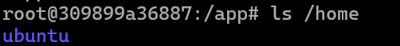
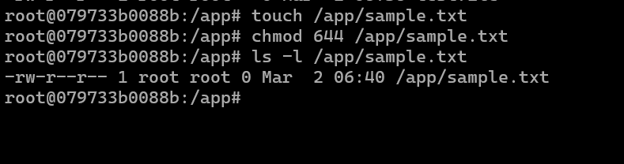

# FileSystem
# Tugas-Analisa-FileSystem
# Analisa Filesystem

## Administrasi Jaringan

**Tugas Menganalisa Filesystem**

**Nama:** Raihan Malano A.  
**NRP:** 3123600019  
**Kelas:** D4 IT A


## Melihat Pathname


Command `pwd` digunakan untuk melihat path direktori saat ini. Dalam kasus ini, direktori kerja saat ini berada di dalam folder `app`.



Perintah `ls` digunakan untuk melihat isi dari suatu folder. Misalnya, `ls /home` digunakan untuk melihat daftar isi dalam direktori `home`.

## Melihat Struktur Direktori Utama


Struktur direktori utama dapat dilihat menggunakan:
```bash
ls -l /
```
Perintah ini menampilkan semua file dan folder dalam direktori root (`/`) beserta izin, pemilik, grup, ukuran, dan informasi lainnya.

## Menentukan Jenis File


Command `file` digunakan untuk menentukan jenis suatu file. Contoh:
```bash
file /bin/bash
```
Hasilnya akan menunjukkan apakah file tersebut adalah binary, script, atau jenis file lainnya.

Command `file` sangat berguna untuk memastikan tipe file sebelum dieksekusi atau dimodifikasi, terutama dalam sistem Linux yang memiliki banyak format file.

## Membuat dan Menggunakan Hard Link


Command `ln` digunakan untuk membuat hard link. Contoh:
```bash
ln /etc/passwd /tmp/passwd_hardlink
```
Hard link memungkinkan beberapa nama file merujuk ke satu inode yang sama dalam filesystem. Hal ini berguna untuk menjaga akses ke file meskipun file asli dihapus, tetapi hanya bisa dibuat dalam satu filesystem yang sama.

## Membuat dan Menggunakan Symbolic Link


Command `ln -s` digunakan untuk membuat symbolic link. Contoh:
```bash
ln -s /etc/passwd /tmp/passwd_symlink
```
Symbolic link (soft link) berbeda dengan hard link karena hanya berisi referensi ke lokasi file asli. Symbolic link dapat menunjuk ke file di filesystem yang berbeda dan tetap berlaku meskipun file asli dihapus.

## Mengubah Izin File


Command `chmod` digunakan untuk mengubah izin file. Contoh:
```bash
chmod 644 /app/sample.txt
```
Perintah ini mengatur izin file sehingga pemilik bisa membaca dan menulis (`rw-`), sementara grup dan lainnya hanya bisa membaca (`r--`). Ini penting untuk mengontrol akses terhadap file dalam lingkungan multi-user.

## Mengubah Kepemilikan File

Command `chown` digunakan untuk mengubah pemilik dan grup file. Contoh:
```bash
chown root:root /app/sample.txt
```
Mengubah kepemilikan file berguna untuk memastikan hanya user atau grup tertentu yang memiliki kontrol terhadap file, terutama dalam sistem yang memiliki banyak pengguna.

## Menggunakan Command umask


Command `umask` digunakan untuk menentukan izin default saat membuat file atau direktori baru. Contoh:
```bash
umask 022
mkdir /app/newdir
ls -ld /app/newdir
```
Dengan `umask 022`, direktori baru akan memiliki izin `755`, yang berarti pemilik memiliki izin penuh, sedangkan grup dan lainnya hanya memiliki izin baca dan eksekusi. Ini berguna untuk mengontrol default permission secara sistematis.

## Menggunakan ACL untuk File Permissions


Command `setfacl` dan `getfacl` digunakan untuk mengelola izin akses file yang lebih fleksibel. Contoh:
```bash
setfacl -m u:username:rw /app/sample.txt
getfacl /app/sample.txt
```
Access Control List (ACL) memungkinkan pengaturan izin lebih detail dibandingkan `chmod`, seperti memberikan akses hanya kepada user tertentu tanpa mengubah izin grup file. Hal ini berguna dalam sistem yang memiliki kontrol akses yang lebih kompleks.

