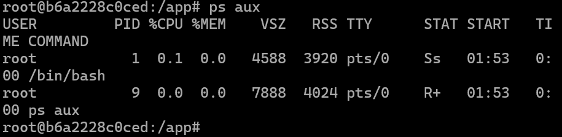
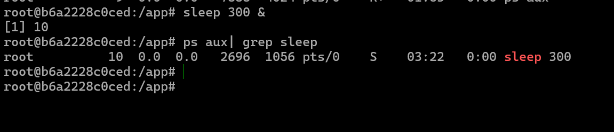
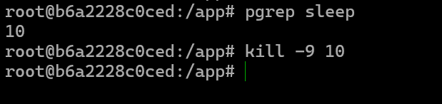
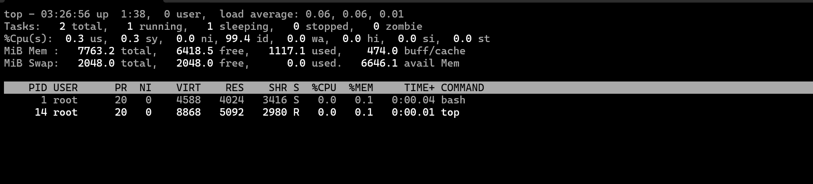
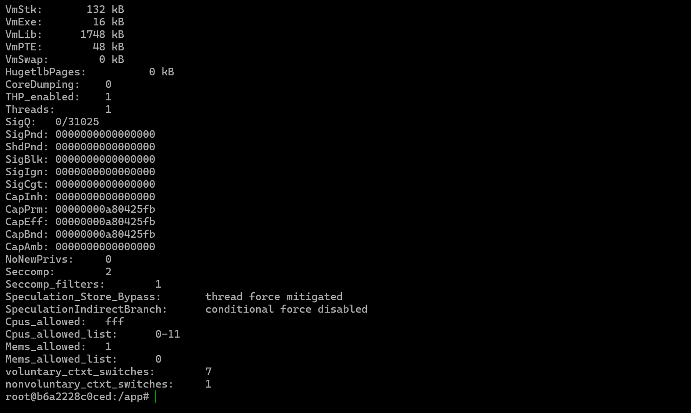
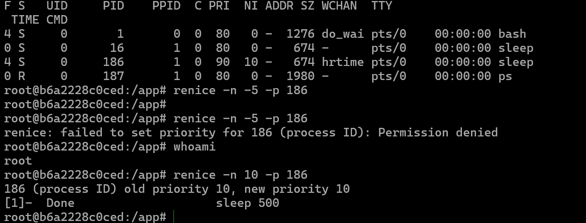
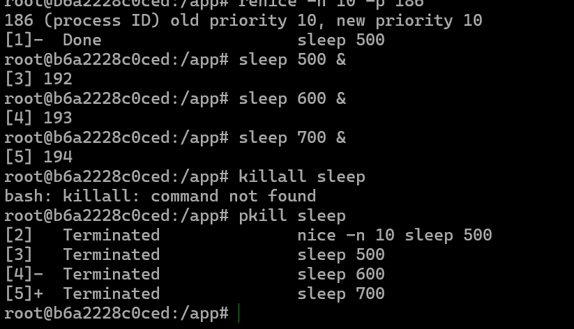
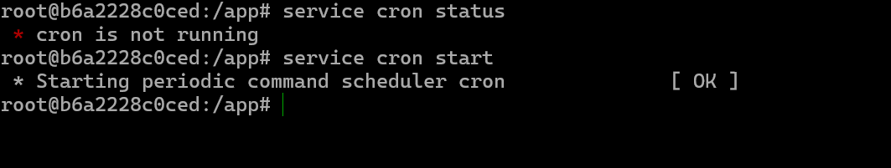

# Process
# Tugas-Analisa-Process
# Analisa Process

## Administrasi Jaringan

**Tugas Menganalisa Process**

**Nama:** Raihan Malano A.  
**NRP:** 3123600019  
**Kelas:** D4 IT A


## Melihat Proses yang Berjalan


Hasil perintah `ps aux` menunjukkan bahwa ada dua proses yang berjalan dalam container Linux. Proses pertama (PID 1) adalah `/bin/bash`, yang berjalan sebagai shell utama dengan status **Ss** (sleeping, session leader), menggunakan sedikit CPU (0.1%) dan memori (0.0%). Proses kedua (PID 9) adalah `ps aux` sendiri, yang sedang dijalankan oleh user `root` untuk menampilkan daftar proses yang berjalan dalam sistem. Statusnya **R+** (running, foreground process), menunjukkan bahwa perintah ini sedang aktif dieksekusi di terminal (`pts/0`). Kedua proses memiliki **RSS (Resident Set Size)** kecil, yang berarti penggunaan memori fisiknya rendah.

## Menjalankan Background Process


Perintah `sleep 300 &` menjalankan proses `sleep` di latar belakang (**background process**) yang akan berjalan selama **300 detik (5 menit)** tanpa interaksi langsung dengan terminal. Karena menggunakan ampersand (`&`), shell tidak menunggu proses selesai dan langsung kembali ke prompt, memungkinkan pengguna menjalankan perintah lain.

## Menghentikan Process


Menghentikan background process yang berjalan dengan command:

```bash
kill <PID>
```

## Memeriksa Process secara Langsung


Menggunakan command `top` untuk memeriksa proses yang sedang berjalan:

```bash
top
```

## Debugging Process dengan Strace


`strace` adalah alat debugging yang digunakan untuk melacak **syscalls** dan sinyal yang dibuat oleh suatu proses dalam Linux:

```bash
strace -p <PID>
```

## Melihat Informasi Proses menggunakan `/proc`


Setiap proses yang berjalan memiliki direktori tersendiri di `/proc`, sehingga kita bisa melihat detailnya, misalnya:

```bash
ls /proc/<PID>
cat /proc/<PID>/status
```

## Mengubah Prioritas Process


Disini saya mencoba menaikkan dan menurunkan prioritas pada proses yang sedang berjalan menggunakan perintah:

```bash
nice -n 10 <command>
renice -n -5 -p <PID>
```

## Menghentikan Process Tertentu


Pada terminal saya menjalankan **3 proses **`` yang berbeda dengan PID **192, 193, dan 194**. Lalu saya menghentikan seluruh proses `sleep` yang ada dengan perintah:

```bash
pkill sleep
```

Perintah ini langsung menghentikan seluruh proses `sleep` yang sedang berjalan.

## Menjadwalkan Tugas dengan Cron


Penggunaan `crontab -e` memungkinkan pengguna untuk menambahkan tugas ke dalam daftar **cron jobs**, seperti menulis pesan ke dalam file log setiap menit. Dengan memastikan layanan cron berjalan menggunakan:

```bash
service cron start
```

sistem dapat menjalankan tugas yang dijadwalkan secara berkala.

